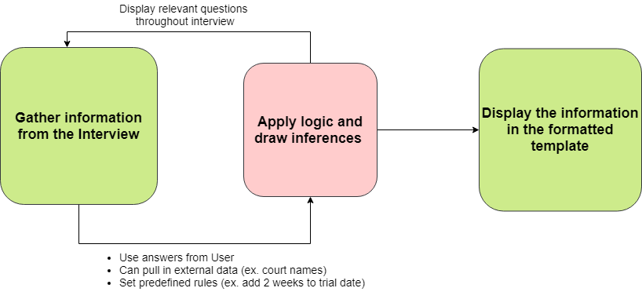

# Document Assembly Working Group

---
# Questions to answer

* What made you decide to join?
* How often should we meet?
* What structure works for future meetings?

---
# Vision for the group

* Provide a jumpstart for authoring basic forms
* Provide opportunity for ongoing lessons to advance your skills
* Develop best practices for future projects
* Create a knowledgebase inside the organization to maintain existing projects
* Build an ongoing library of reusable examples, modules, etc. 
* Promote reuse and sharing

---
# Places to get help

* These meetings
* Docassemble documentation
* Sample interviews
* Slack: docassemble.slack.com #GBLS
* Mailing list?

---
# What is Docassemble?

> A tool to build document automation and expert systems, with the full power of Python underneath.

---
# What is Document Automation?

---
# What is Python?

> A "human readable" programming language, designed to be friendly to new programmers and learners.

    !python
    print "Hello, World."

Python 

---
# What makes Docassemble different?

* Easy to get started with
* Scalable to your imagination
* You can do a lot with the most common and easiest to learn features

{width=100%}

---
# Workflow of a Docassemble Interview

* Template + Interview => Final Document
* Template: formatted document, with display logic
* Interview: series of questions with logic and connection to external world
* Templates can be created in Microsoft Word or Acrobat
* The interview can be created in the Playground

---
# Tour of the Playground
---
# Key concepts

## To create a simple form, you should understand:

1. Variables or fields
2. Datatypes
3. IF statements (conditional logic)

These 3 concepts are all you need to automate 90% of forms. The rest is to make your interview better.

---
# Hello, World

## A first programming exercise

    !yaml
    mandatory: True
    question: Hello, World
---
# Adding in a question

## The `fields` statement

    !yaml
    ---
    question: Information about you
    fields:
        - Your name: user_name
        - Your favorite number: user_number
    ---
    mandatory: True
    question: Hello, ${user_name}. Your favorite number is ${user_number}

---
# Add in some logic

    !yaml
    ---
    question: Information about you
    fields:
        - Your name: user_name
        - Your favorite number: user_number
          datatype: integer
    ---
    code: |
        if user_number == 42:
            text = "You know the meaning of life, the universe and everything!"
        else:
            text = "You still have time to learn the meaning of life."

    ---
    mandatory: True
    question: Hello, ${user_name}. 
    subquestion: |
        Your favorite number is ${user_number}. 
        
        ${text}
---
# Assemble a document

    !yaml
    ---
    question: Information about you
    fields:
        - Your name: user_name
        - Your favorite number: user_number
          datatype: integer
    ---
    code: |
        if user_number == 42:
            text = "You know the meaning of life, the universe and everything!"
        else:
            text = "You still have time to learn the meaning of life."
    ---
    mandatory: True
    question: Your download is ready.

    attachment:
        - name: download
          filename: my_download
          content: |
            Hello, ${user_name}. 
    
            Your favorite number is ${user_number}. 
            
            ${text}
---
# How to work outside of the sessions

1. Try it using what you know.
1. Look at the documentation.
1. Show what you tried on Slack or in a working group session and we may
help you find a different (better?) way to do it.

---
# Future topics

* Creating your first real interview
* Solving problems: troubleshooting and testing
* Using a file you already have as a template (filling Docx and PDF templates)
* Decorating your interview: images, videos, metadata and help fields
* Using logic in your questions, templates, and interview display
* Using built-in functions
* Using built-in classes (objects) and methods: Individual and Address classes
* Github, Google Drive or OneDrive integration
* Gathering multiple items into a group (lists, dictionaries and sets)
* Displaying a group in a document (control structures)
* Generic object, special variable `i`
* Communicating with the world by email or text
* APIs: getting data from the outside world
* Scheduling automatic actions
* Review blocks
* Advanced Python techniques
* Writing custom functions and classes